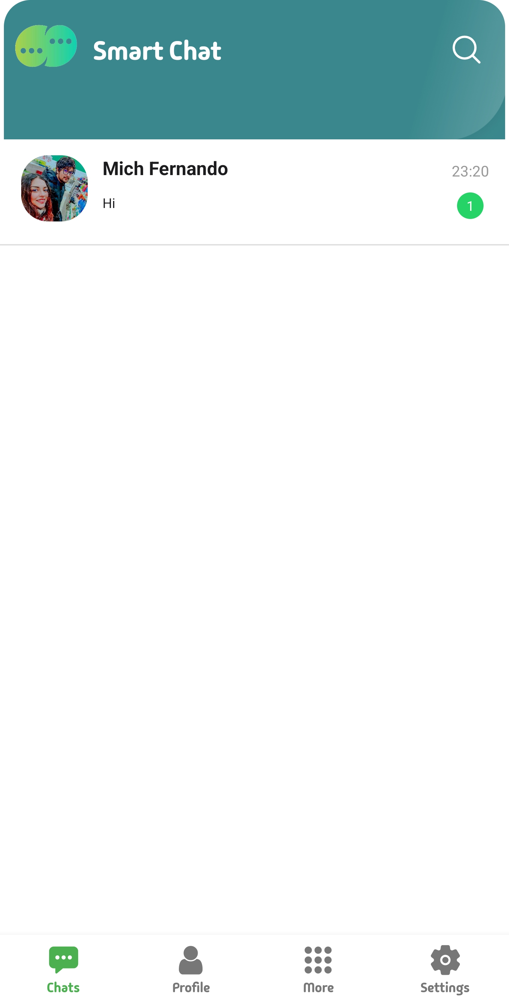
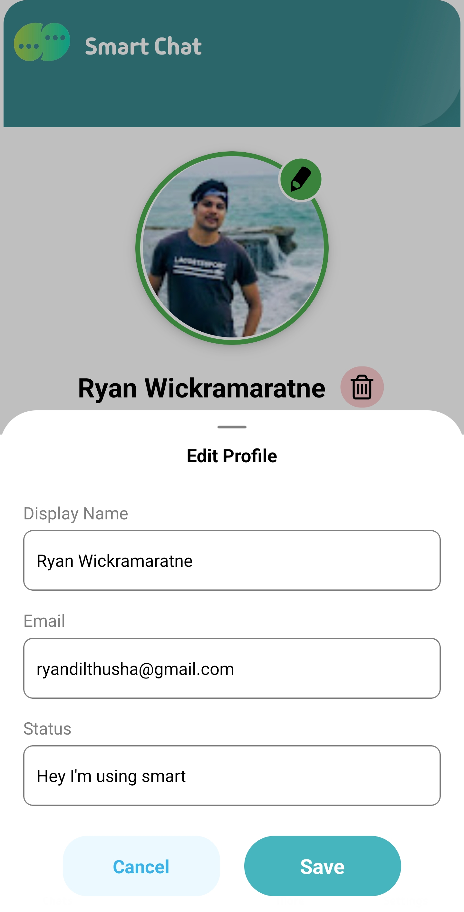

# 💬 Smart Chat

## 📑 Table of Contents

1. [📱 Installation & Quick Start](#-installation--quick-start)
2. [📞 Call Setup (Agora)](#-call-setup-agora)
3. [👨🏻‍🏫 Introduction](#-introduction)
4. [🧪 Features](#-features)
5. [🖼️ App UI Preview](#-app-ui-preview)
6. [📚 Pages Overview](#-pages-overview)
   - [💬 Chats Page](#-chats-page)
   - [💭 Individual Chat Page](#-individual-chat-page)
   - [🔍 Search Page](#-search-page)
   - [👤 Profile Page](#-profile-page)
   - [➕ More Page](#-more-page)
   - [⚙️ Settings Page](#-settings-page)
7. [🧩 Technologies Used](#-technologies-used)
8. [🔥 Firebase Setup and Configuration](#-firebase-setup-and-configuration)
9. [📂 Folder Structure](#-folder-structure)
10. [🛠️ Contribution](#️-contribution)
11. [📜 License](#-license)
12. [👥 Author](#-author)

Smart Chat is a modern and engaging messaging app built with React Native. It supports real-time messaging, profile customization, audio calling using Agora, multi-language support, and built-in games — all wrapped in a smooth and elegant UI.

---

> [!Note]
> This app is built for mobile chat experiences that are quick, fun, and expandable. It supports future upgrades such as video calling and monetizable games.

> [!Tip]
> You can use the demo link to install the app quickly on any mobile device. Or clone and run it locally using Expo.

---

## 📱 Installation & Quick Start

Install via Expo:

🔗 [**Smart Chat - Expo Build Link**](https://expo.dev/accounts/mobiledev-smart-app/projects/Mobile-App-Client/builds/449c9840-b37c-467e-b219-d29b0626c4c5)

Or scan the QR code:


Clone and run locally:

```bash
git clone https://github.com/Group15-Mobile-Development-ReactNative/Mobile-App-Client.git
cd Mobile-App-Client
npm install
npx expo start
```

---

## 📞 Call Setup (Agora)

> [!Important]
> This section guides you through setting up audio call functionality using the Agora SDK.

### 🔑 Step 1: Create an Agora Project

1. Go to [Agora Console](https://sso2.agora.io/)
2. Sign in or create a new account
3. Click **"Create New Project"**
4. Enter a project name like `SmartChat`
5. **Enable Primary Certificate** under Authentication Method
6. After creating the project, copy the **App ID**

### 🔐 Step 2: Generate Temporary Token (for testing)

1. Inside the Agora project page, go to **"Project Management"**
2. Click on your created project (e.g. `SmartChat`)
3. Scroll down to **"Generate Temp Token"** section
4. Set Channel Name to `ChatAppCall`
5. Select **Audio Call**
6. Click **"Generate Temp Token"**

### 🧩 Step 3: Update Configuration File

Open the file:

```
/constants/agoraConfig.ts
```

Replace the placeholders with your own credentials:

```ts
export const AGORA_APP_ID = "<Your App ID here>";
export const AGORA_TEMP_TOKEN = "<Your Temporary Token here>"; // Only for development
export const CHANNEL_NAME = "ChatAppCall";
```

### 🎯 Step 4: Use in the App

Once these values are set, the app can initiate and receive audio calls. On the **Individual Chat Page**, pressing the call icon triggers Agora and opens the call interface.

> [!Warning]
> Temp tokens are short-lived and should only be used for development. For production, implement a secure token server.

### 📹 Demo Preview

Below is a screen recording demonstrating how to set up Agora and use it in the app:


---

## 👨🏻‍🏫 Introduction

**Smart Chat** is built to offer a clean, WhatsApp-like chat experience with extra features including built-in mini games, dark mode, and user analytics. The interface includes:

- Smooth navigation using bottom tabs
- Real-time chatting and message tracking
- Profile editing and account deletion
- Secure authentication and data management with Firebase

---

## 🧪 Features

- 🔐 Email & Google Sign-in
- 💬 Text + Image Messaging
- 📞 Agora-based Audio Calling
- ✏️ Profile Edit and Status Updates
- 🚮 Message & Chat Deletion
- 🌗 Dark Mode Support
- 🌍 Language Selection (English, Suomi)
- 📊 Chat Statistics with Pie Chart
- 🎮 Mini Games to kill wait time
- ⚙️ Settings + Static Info Pages

---

## 🖼️ App UI Preview

> [!Note]
> For full functionality breakdowns of each page, refer to future prompts. Below are screen previews.

### Login & Register
| Login | Register |
|-------|----------|
|  |  |

### Chat Interface
| Chat List | Message View |
|-----------|---------------|
|  |  |

### Profile Management
| Profile Page | Edit Modal |
|--------------|------------|
|  |  |

### Additional Pages
| Stats | Games | Settings |
|-------|-------|----------|
|  |  |  |

---

## 📚 Pages Overview

# 💬 Chats Page

### General Description:
The home screen that displays all existing chat conversations with other users. It shows profile pictures, last messages, and unread message indicators. From here, users can enter individual chat threads or search for others.

### Technical Details:
<details>
<summary>Click to expand</summary>

- **Screen File:** `app/screens/(tabs)/chats/index.tsx`
- Uses Firebase Firestore to fetch the latest chats.
- Displays the last message, time, and unread count using listeners.
- On long-pressing a chat, an alert appears to confirm chat deletion.
- Connected to bottom tab navigation via Expo Router.
- Includes a `HeaderBannerSearch` component for accessing the Search Page.

</details>

### Preview:


---

# 💭 Individual Chat Page

### General Description:
This is the chat thread between two users. Supports real-time messaging with text, images, and call features. Messages are styled based on sender and grouped by timestamp.

### Technical Details:
<details>
<summary>Click to expand</summary>

- **Screen File:** `app/screens/chats-screen/index.tsx`
- Uses Firestore to load/send messages
- Long-press enables message deletion via modal
- Includes Agora voice calling (video reserved for future)
- Displays sender’s info in header: image, name, call/video icons

</details>

### Preview:


---

# 🔍 Search Page

### General Description:
Displays all registered users. Allows selecting a user to start a conversation, leading to the individual chat view.

### Technical Details:
<details>
<summary>Click to expand</summary>

- **Screen File:** `app/screens/search-screen/index.tsx`
- Fetches user data from Firestore
- Uses custom `HeaderBannerSearch` for consistent UI

</details>

### Preview:


---

# 👤 Profile Page

### General Description:
Users can view and manage their profile, update photo, display name, email, and status. Also includes logout and delete account functionality.

### Technical Details:
<details>
<summary>Click to expand</summary>

- **Screen Files:** `app/screens/(tabs)/profile/index.tsx`, `modal.tsx`
- Editable modal updates Firestore user data
- Photo picker integrated via ImagePicker
- Delete user removes data from Firestore and Storage

</details>

### Preview:


---

# ➕ More Page

### General Description:
Access app extras like Stats and Games. Offers lightweight, fun features for user engagement.

### Technical Details:
<details>
<summary>Click to expand</summary>

- **Screen File:** `app/screens/(tabs)/more/index.tsx`
- Connected via drawer navigation
- Links to stats and two built-in games:
  - `TapTheCircleGame.tsx`
  - `MemoryFlipGame.tsx`

</details>

### Preview:


---

# ⚙️ Settings Page

### General Description:
Manage app preferences like dark mode, language, and legal pages (ToS, Privacy). Includes Help Center with support content.

### Technical Details:
<details>
<summary>Click to expand</summary>

- **Screen File:** `app/screens/(tabs)/settings/index.tsx`
- Dark Mode managed via `ThemeContext`
- Language toggled through `LanguageContext`
- Static pages: `about.tsx`, `privacy.tsx`, `terms.tsx`, `help.tsx`
- Help articles loaded from Firestore with search feature

</details>

### Preview:


---

## 🧩 Technologies Used

This app leverages modern React Native tools along with Firebase and third-party libraries to deliver real-time chat functionality, audio calling, and more.

- **React Native**: Core mobile framework
- **Expo Router**: File-based routing system for easier navigation
- **Firebase Authentication**: User authentication (Email/Google sign-in)
- **Cloud Firestore**: Real-time NoSQL database for storing users, messages, chats, and calls
- **Firebase Storage**: To store and fetch user profile pictures and images shared in chats
- **Agora SDK**: For real-time audio calling between users
- **react-native-chart-kit**: Used to render charts for the Stats page (e.g., Top 5 chats)
- **expo-image-picker**: Allows users to choose profile pictures or send images in chat
- **expo-camera**: Provides camera access for instant photo sharing in chat
- **expo-secure-store**: Used for storing login credentials securely ("Remember Me")
- **react-native-svg**: Required by the charting library for rendering vector graphics
- **Custom Contexts**: Language and Theme management through `LanguageContext` and `ThemeContext`

---

## 🔥 Firebase Setup and Configuration

The app uses Firebase extensively for backend services:

### 🧾 Firestore Collections:
- **users**: Stores user data such as `displayName`, `email`, `profilePic`, `pushToken`, and `status`
- **chats**: Each document stores a chat between two users with fields like `lastMessage`, `unreadA`, `unreadB`, `userA`, `userB`, etc.
- **messages**: Sub-collections under a `chatId` for all exchanged messages (text, imageUrl, timestamps)
- **calls**: Stores current/ongoing or past voice call logs with `callerId`, `receiverId`, `token`, `channelName`, etc.

### 📷 Firebase Storage Folders:
- `chatImages/`: Stores shared media inside chats
- `profilePics/`: Stores user profile pictures

### 🔐 Authentication:
- Sign-in options: Email/Password and Google Sign-In (via Firebase Auth providers)
- All registered users are automatically saved to Firestore in the `users` collection

---

## 📂 Folder Structure

```bash
Mobile-App-Client/
├── app/
│   ├── screens/
│   │   ├── (tabs)/
│   │   │   ├── chats/
│   │   │   ├── profile/
│   │   │   ├── more/
│   │   │   └── settings/
│   │   ├── auth-screens/
│   │   ├── call/
│   │   ├── chats-screen/
│   │   ├── games-pages/
│   │   ├── search-screen/
│   │   ├── splash.tsx
│   ├── components/
│   ├── constants/
│   ├── context/
│   ├── firebase/
│   ├── assets/
│   │   ├── auth-images/
│   │   ├── flag-images/
│   │   ├── fonts/
│   │   ├── game-images/
│   │   ├── games-images/
│   │   ├── header-images/
│   │   └── settings-images/
├── .expo/
├── .gitignore
├── app.json
├── eas.json
├── expo-env.d.ts
├── google-services.json
├── package.json
├── package-lock.json
```

---

## 🛠️ Contribution

Feel free to fork, suggest improvements, or create pull requests.

1. Fork the repo
2. Create a feature branch (`git checkout -b feature-name`)
3. Commit your changes (`git commit -m "Add feature"`)
4. Push and submit a PR

---

## 📜 License

This project is licensed under the MIT License.

---

## 👥 Author

Built by **Group 15**:

- Ryan Wickramaratne
- Mich Fernando
- And the Smart Dev Team 💡

